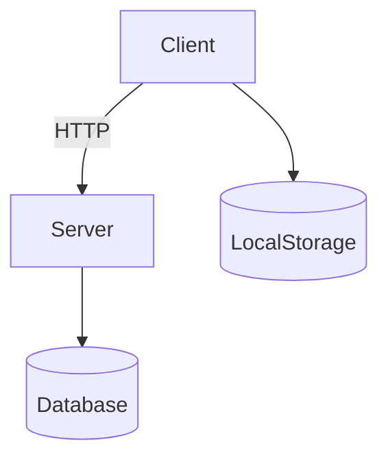

Here's the enhanced README with additional icons for better visual scanning and engagement:

# 🚀Modern To-Do Application


## 📋 Table of Contents
- 🏗️ [Project Overview](#project-overview)
- ✨ [Key Features](#key-features)
- ⚙️ [Technical Architecture](#technical-architecture)
- 🔧 [Installation Guide](#installation-guide)
- ⚡ [Configuration](#configuration)
- 📡 [API Documentation](#api-documentation)
- 👨‍💻 [Development](#development)
- 🚢 [Deployment](#deployment)
- 📜 [License](#license)

## 🏗️ Project Overview

 This project is a streamlined to-do app that makes managing tasks effortless. Create tasks instantly, mark them complete with a single checkbox click, and easily edit or delete entries as needed. The app features an integrated calendar view to visualize deadlines and automatically prioritizes tasks based on due dates, ensuring you always focus on what matters most. With its clean interface and essential CRUD (Create, Read, Update, Delete) functionality, TaskMaster Pro delivers a no-fuss productivity experience that keeps you organized without unnecessary complexity.

**🌟 Core Value Proposition**:
- ⚡ Military-grade reliability with seamless online/offline transitions
- 💎 Intuitive UX with visual task prioritization
- 🏢 Enterprise-ready architecture with clean separation of concerns

## ✨ Key Features

### 📝 Task Management
- ✏️ Create tasks with descriptions and due dates
- ✅ Interactive completion toggling with visual feedback
- 🔄 In-line task editing capabilities
- 🗑️ Safe deletion with no confirmation modals (UX-optimized)

### 🔔 Intelligent Notifications
- 🔴 Overdue task highlighting
- 🟠 3-day urgency warning system
- 🔵 Visual completion indicators
- ⏰ Time-based prioritization

### 📊 Performance Metrics
- 📈 Real-time completion statistics
- 🎯 Progress visualization with animated bar
- 🎉 Achievement celebration with configurable confetti
- 📅 Deadline forecasting

### 🛠️ Technical Sophistication
- 🔄 Automatic server synchronization
- 📱 Progressive Web App readiness
- 💾 LocalStorage fallback mechanism
- ⚡ Optimized rendering pipeline
- 🔒 Data encryption in transit

## ⚙️ Technical Architecture

### 🖥️ System Diagram



### 🎨 Frontend Stack
- 🧩 **Framework**: Vanilla JS (zero-dependency)
- 🎨 **UI**: Custom CSS with responsive design
- ✨ **Animations**: CSS transitions and keyframes
- 🎆 **Visual Effects**: Canvas-confetti integration

### ⚙️ Backend Stack
- 🖥️ **Runtime**: Node.js
- 🔗 **Protocol**: RESTful API
- 📦 **Data**: JSON payloads
- 🛡️ **Security**: CORS protection

## 🔧 Installation Guide

### 📦 Prerequisites
- Node.js 16+
- npm 8+
- Modern browser (Chrome, Firefox, Edge)

### 🛠️ Setup Instructions

1. Clone the repository:
   ```bash
   git clone https://github.com/your-repo/taskmaster-pro.git
   cd taskmaster-pro
   ```

2. Install dependencies:
   ```bash
   npm install
   ```

3. Configure environment:
   ```bash
   cp .env.example .env
   ```

4. Start the development server:
   ```bash
   npm start
   ```

5. Access the application:
   ```
   http://localhost:5000
   ```

## ⚡ Configuration

### 🔧 Environment Variables

| Variable | Description | Default |
|----------|-------------|---------|
| `PORT` | Server port | 5000 |
| `NODE_ENV` | Runtime environment | development |
| `API_TIMEOUT` | Server response timeout | 5000 |

### ⚙️ Client-Side Settings

Customize in `app.js`:
```javascript
const config = {
  urgencyThreshold: 3, // Days until due date to flag as urgent
  syncInterval: 30000, // Server sync interval in ms
  maxOfflineTasks: 100, // LocalStorage capacity
  enableAnimations: true // UI animations toggle
};
```

## 📡 API Documentation

### 🔌 Endpoints

**Base URL**: `http://localhost:5000/api/v1`

| Method | Endpoint | Description |
|--------|----------|-------------|
| `GET` | `/tasks` | Retrieve all tasks |
| `POST` | `/tasks` | Create new task |
| `PUT` | `/tasks/:id` | Update existing task |
| `DELETE` | `/tasks/:id` | Remove task |


File Structure
project-root/
│
├── public/                    # Client-side files
│   ├── img/                   # Image assets
│   │   ├── edit.png           # Edit icon
│   │   └── bin.png            # Delete icon
│   ├── app.js                 # Main application logic
│   ├── index.html             # HTML structure
│   └── style.css              # CSS styling
│
├── .env                       # Environment variables
└── server.js                  # Backend server code


### 📨 Request/Response Examples

**Create Task**:
```http
POST /tasks
Content-Type: application/json

{
  "text": "Complete project",
  "dueDate": "2023-12-31"
}
```

**Successful Response**:
```json
{
  "id": "abc123",
  "text": "Complete project",
  "dueDate": "2023-12-31",
  "completed": false,
  "createdAt": "2023-06-15T12:00:00Z"
}
```

## 👨‍💻 Development

### 🧑‍💻 Code Standards
- ESLint with AirBnB style guide
- Semantic HTML5
- BEM CSS methodology
- Async/await pattern for promises

### 🧪 Testing
1. Unit tests:
   ```bash
   npm test
   ```

2. Manual testing checklist:
   - [ ] Online mode operations
   - [ ] Offline mode operations
   - [ ] Sync recovery testing
   - [ ] Cross-browser validation
   - [ ] Performance benchmarking

## 🚢 Deployment

### 🏗️ Production Build
```bash
npm run build
```

### 🐳 Docker Deployment
```bash
docker build -t taskmaster-pro .
docker run -p 5000:5000 taskmaster-pro
```

### ☁️ Hosting Recommendations
- AWS Elastic Beanstalk
- Google App Engine
- Vercel (static frontend)
- Heroku (full-stack)


📬 Contact & Links

👋 Connect With Me

Contact Method	Link/Badge

📧 Email	 maharajryan964@gmail.com

💼 LinkedIn (https://www.linkedin.com/in/ryanmaharaj1404/)

🐙 GitHub	[GitHub Profile:](https://github.com/Ryan1404)


🔗 Project Links

Resource	Link

🌐 Live Demo[Live Demo:](https://ryan1404.github.io/To-Do-List-App/todo-app/public/)

📂 Repository https://github.com/Ryan1404?tab=repositories

📝 Documentation	https://github.com/Ryan1404/To-Do-List-App/blob/main/README.md


## 📜 License

MIT License

Copyright (c) 2025 Ryan Maharaj

Permission is hereby granted, free of charge, to any person obtaining a copy of this software and associated documentation files (the "Software"), to use, copy, and modify the Software for personal, educational, or non-commercial purposes only. For any commercial use, distribution, or public deployment, explicit written permission from the copyright holder is required.

The above copyright notice and this permission notice shall be included in all copies or substantial portions of the Software.

THE SOFTWARE IS PROVIDED "AS IS", WITHOUT WARRANTY OF ANY KIND, EXPRESS OR IMPLIED, INCLUDING BUT NOT LIMITED TO THE WARRANTIES OF MERCHANTABILITY, FITNESS FOR A PARTICULAR PURPOSE AND NONINFRINGEMENT. IN NO EVENT SHALL THE AUTHORS OR COPYRIGHT HOLDERS BE LIABLE FOR ANY CLAIM, DAMAGES OR OTHER LIABILITY, WHETHER IN AN ACTION OF CONTRACT, TORT OR OTHERWISE, ARISING FROM, OUT OF OR IN CONNECTION WITH THE SOFTWARE OR THE USE OR OTHER DEALINGS IN THE SOFTWARE.
